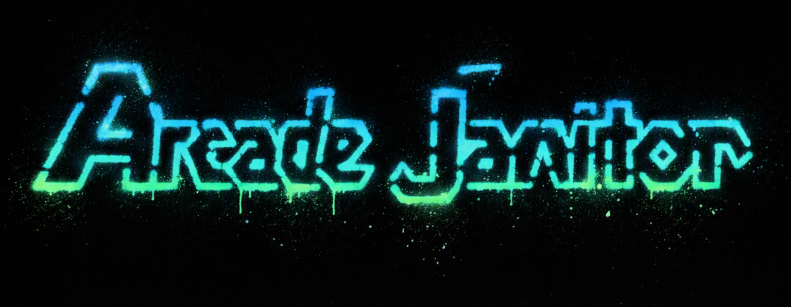

# ArcadeJanitor

[![CI][ci-shield]][ci-url]
[![Release][release-shield]][release-url]
[![Latest Release][latest-release-shield]][latest-release-url]
[![Rust][rust-shield]][rust-url]
[![Rust Edition][edition-shield]][edition-url]
[![License][license-shield]][license-url]



ArcadeJanitor is a focused Rust CLI and MCP server for managing MAME ROM folders using only `mame.xml` and `catver.ini` metadata.

## Why ArcadeJanitor?

ArcadeJanitor began with a straightforward need: clean up a main MAME ROM directory.
Existing tools offered powerful capabilities, but their complexity was more than was
needed for that task. ArcadeJanitor is designed to be simple and fast for focused ROM
folder cleanup, whether used directly from the command line or through an AI agent.

## Workspace

- `src/arcadejanitor-core` - shared models, parsers, operations, and utilities
- `src/arcadejanitor-cli` - command-line interface
- `src/arcadejanitor-mcp` - Axum HTTP/WebSocket MCP server

## v1 scope

ArcadeJanitor v1 supports MAME ROM folders, `mame.xml`, `catver.ini`, catalog queries,
collection filtering and auditing, statistics, moving, deleting, and metadata cache
management. It intentionally excludes CHDs, BIOS dependency resolution, scraping, GUI,
dashboards, cloud sync, plugins, and non-MAME systems.

`--catver` is optional. When it is omitted, ArcadeJanitor downloads
[`catver.ini`](https://github.com/AntoPISA/MAME_SupportFiles/tree/main/catver.ini) from the
maintained upstream repository on first use and caches it in the current user's OS cache
directory. Supplying `--catver <path>` always uses that file instead.

When `--mame-executable <path>` is supplied without `--mame-xml`, ArcadeJanitor runs
`mame.exe -listxml` and caches the result in the current user's OS cache directory.
The cached XML is reused when no XML path or executable is provided.

## Installation

Download the package for your operating system from the
[latest GitHub release](https://github.com/PlagueHO/arcade-janitor/releases/latest).
Each package contains the `arcadejanitor` CLI and `arcadejanitor-mcp` server.

On Linux or macOS, extract the downloaded archive:

```bash
# Use "macos" instead of "linux" when extracting the macOS package.
tar -xzf arcadejanitor-<version>-linux.tar.gz
chmod +x arcadejanitor arcadejanitor-mcp
./arcadejanitor --help
```

On Windows, extract the downloaded archive with PowerShell:

```powershell
Expand-Archive .\arcadejanitor-<version>-windows.zip -DestinationPath .\arcadejanitor
Set-Location .\arcadejanitor
.\arcadejanitor.exe --help
```

Move the extracted binaries to a directory on `PATH` to run them from any
location, or use the relative paths shown in the examples below.

## CLI

ArcadeJanitor uses a resource-first command structure:

```text
arcadejanitor
├── rom        list, show, move, delete, stats, audit
├── catalog    list, show
├── category   list, show
├── source     list, refresh, clear
└── completions
```

Use `arcadejanitor <resource> --help` and
`arcadejanitor <resource> <command> --help` to discover commands and options.

### Examples

```bash
./arcadejanitor rom list ./roms --genre maze --mame-xml ./mame.xml --catver ./catver.ini
./arcadejanitor rom show ./roms pacman --mame-xml ./mame.xml --catver ./catver.ini
./arcadejanitor catalog show pacman --mame-xml ./mame.xml --catver ./catver.ini --output json
./arcadejanitor catalog list --manufacturer Namco --year 1980..1985 --mame-xml ./mame.xml
./arcadejanitor category show Shooter --subcategory vertical --mame-xml ./mame.xml
./arcadejanitor rom move ./roms ./filtered --genre maze --mame-xml ./mame.xml
./arcadejanitor rom move ./roms ./filtered --genre maze --execute --mame-xml ./mame.xml
./arcadejanitor rom delete ./roms --name "prototype*" --execute --mame-xml ./mame.xml
./arcadejanitor rom stats ./roms --output json --mame-xml ./mame.xml
./arcadejanitor rom stats ./roms --category Shooter --subcategory "Flying Vertical" --show-missing --output json --mame-xml ./mame.xml
./arcadejanitor rom stats ./roms --show-missing --show-unmatched --output json --mame-xml ./mame.xml
./arcadejanitor rom audit ./roms --mame-xml ./mame.xml
./arcadejanitor source list --output table
./arcadejanitor completions powershell
```

`rom move`, `rom delete`, and `source clear` only preview their operations unless
`--execute` is present. ROM mutations also require at least one selector or explicit
`--all`.

All list-like commands support table, JSON, and TSV output with `--output`. Use
`--no-header` for headerless table or TSV output. Result data is written to stdout;
progress and diagnostics are written to stderr.

`rom stats` always includes aggregate missing and unmatched counts. Add
`--show-missing` or `--show-unmatched` to include the corresponding ROM names.

The source options `--mame-xml`, `--mame-executable`, and `--catver` are global and can
appear before or after a subcommand. Their environment variable equivalents are
`ARCADEJANITOR_MAME_XML`, `ARCADEJANITOR_MAME_EXECUTABLE`, and `ARCADEJANITOR_CATVER`.

Start the MCP server:

```bash
./arcadejanitor-mcp
```

The server listens on `http://127.0.0.1:3000` by default. Keep it running in a
separate terminal while using an MCP client. Set `ARCADEJANITOR_MCP_ADDR` to change
the listen address. Set `ARCADEJANITOR_MCP_TOKEN` to enable the destructive tools
(`move_roms` and `delete_roms`).

### Install in VS Code

Start the extracted MCP server:

```bash
./arcadejanitor-mcp
```

Create `.vscode/mcp.json` in your workspace (or use **MCP: Open User
Configuration** from the Command Palette) with:

```json
{
  "servers": {
    "arcadejanitor": {
      "type": "http",
      "url": "http://127.0.0.1:3000/mcp"
    }
  }
}
```

Save the file, then use the MCP tools from GitHub Copilot Chat. If
`ARCADEJANITOR_MCP_TOKEN` is set, add the matching bearer token to the
configuration's `headers` object:

```json
"headers": {
  "Authorization": "Bearer YOUR_TOKEN"
}
```

### Install in GitHub Copilot CLI

Start the server in a separate terminal:

```bash
./arcadejanitor-mcp
```

Register its Streamable HTTP endpoint with Copilot CLI:

```bash
copilot mcp add --transport http arcadejanitor http://127.0.0.1:3000/mcp
```

The configuration is saved to `~/.copilot/mcp-config.json`. To use
destructive tools, include the token when registering the server:

```bash
copilot mcp add --transport http \
  --header "Authorization: Bearer YOUR_TOKEN" \
  arcadejanitor http://127.0.0.1:3000/mcp
```

Use `/mcp` in an interactive Copilot CLI session to verify that `arcadejanitor`
is connected and to view its available tools.

Endpoints:

- `GET /health`
- `POST /mcp` (MCP JSON-RPC)
- `GET /ws`

Set `ARCADEJANITOR_MCP_TOKEN` to enable the destructive MCP tools; without it, those tools are
unavailable. Clients must authenticate using the standard HTTP authorization header. WebSocket
connections from non-local browser origins are rejected.

## Development

### Integration tests

The integration suite keeps a deterministic, cut-down metadata dataset in
[`tests/fixtures/`](tests/fixtures): 100 MAME XML machines and 100 catver entries.
Each CLI and MCP integration test creates its ROM folder under a `tempfile`
directory and writes only small fake ROM files, so tests never use or modify the
developer's ArcadeJanitor cache or ROM collection.

Run the end-to-end suites with:

```powershell
cargo test -p arcadejanitor-cli --test cli
cargo test -p arcadejanitor-mcp --test http_integration
```

The CLI test launches the compiled binary and verifies JSON output. The MCP
test launches the server on an ephemeral localhost port and calls the
`scan_roms` tool through `POST /mcp`, which is the recommended boundary for
testing an HTTP MCP server. Lower-level handler tests remain useful for fast
protocol edge cases; use both layers rather than mocking the server transport.

### Windows prerequisites

The Windows Rust toolchain in this project targets MSVC. Install the **Desktop
development with C++** workload from the Visual Studio Installer, including the
Windows SDK, then run Cargo from a **Developer PowerShell for Visual Studio**
terminal. This puts Microsoft's linker and its required libraries on `PATH`.

If the linker error reports `Usage: link FILE1 FILE2`, a different executable
named `link.exe` is being found first. Check the selected executable with:

```powershell
Get-Command link.exe -All
```

Run Cargo from the Visual Studio Developer PowerShell, or remove/reorder the
conflicting `link.exe` directory in your user/system `PATH`. For example, if
`C:\Program Files\coreutils\bin\link.exe` is returned, remove that directory
from `PATH` for the current Visual Studio Developer PowerShell session:

```powershell
$env:Path = ($env:Path -split ';' | Where-Object { $_ -ne 'C:\Program Files\coreutils\bin' }) -join ';'
```

The selected linker should be Visual Studio's `link.exe`, typically under
`Microsoft Visual Studio\...\VC\Tools\MSVC\...\bin\Hostx64\x64`.

Alternatively, use the repository's Dev Container, which provides a Linux Rust
toolchain and avoids host linker configuration.

### Dev Container

Open this repository in VS Code and run **Dev Containers: Reopen in Container** to
use the checked-in Rust development environment. It installs the stable Rust
toolchain with `rustfmt`, `clippy`, and `rust-src`, GitHub CLI, and the
workspace's recommended extensions. The MCP API is forwarded on port `3000`.

```bash
cargo fmt --all -- --check
cargo clippy --workspace --all-targets -- -D warnings
cargo test --workspace
```

<!-- Badge reference links -->
[ci-shield]: https://img.shields.io/github/actions/workflow/status/PlagueHO/arcade-janitor/ci.yml?branch=main&label=CI
[ci-url]: https://github.com/PlagueHO/arcade-janitor/actions/workflows/ci.yml
[release-shield]: https://img.shields.io/github/actions/workflow/status/PlagueHO/arcade-janitor/release.yml?branch=main&label=Release
[release-url]: https://github.com/PlagueHO/arcade-janitor/actions/workflows/release.yml
[latest-release-shield]: https://img.shields.io/github/v/release/PlagueHO/arcade-janitor?label=Latest%20Release
[latest-release-url]: https://github.com/PlagueHO/arcade-janitor/releases/latest
[rust-shield]: https://img.shields.io/badge/Rust-stable-orange?logo=rust
[rust-url]: https://www.rust-lang.org/tools/install
[edition-shield]: https://img.shields.io/badge/Rust%20Edition-2024-orange?logo=rust
[edition-url]: https://doc.rust-lang.org/edition-guide/rust-2024/index.html
[license-shield]: https://img.shields.io/github/license/PlagueHO/arcade-janitor
[license-url]: https://github.com/PlagueHO/arcade-janitor/blob/main/LICENSE
